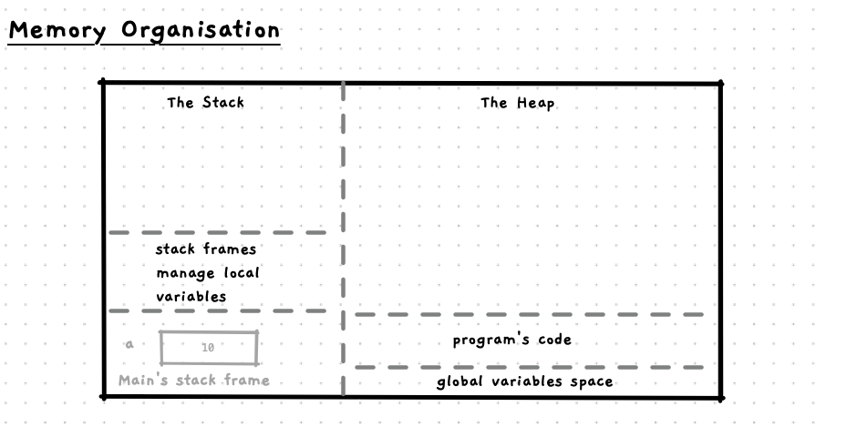

So far we have been exploring how to use pointers to refer to data values in memory... but I want you now to have a look at this diagram again. Other than *data*, what else is in memory? Something we may not think about as data usually...

## Code in memory

While we think of our code as the program that is running, it is also data. It is loaded when your program starts, and the computer is using the instructions from memory to determine what to do.

Now, let's add pointers into the mix. A pointer can refer to a location in memory. We can point to data values on the stack, we can point to our global variables, we can point to dynamically allocated space on the heap... can we point to our code?

Yes we can!

We could point to any instruction in memory, but which instructions would make sense to point to, and how can we use them?

## Function pointers

In C/C++ we can use pointers to refer to any function/procedure that we have created. These are known as [function pointers](/book/part-2-organised-code/6-indirect-access/5-reference/01-01b-function-pointer-use). This makes sense. Functions are designed to be called, so we could call them via a pointer if we can get the address of where the function is in memory... and this is exactly what we can do in C/C++.

In these next pages we will look at using function pointers to make our list more useful. Getting it to take care of the iteration, and allowing the caller to pass in the action to be performed.
