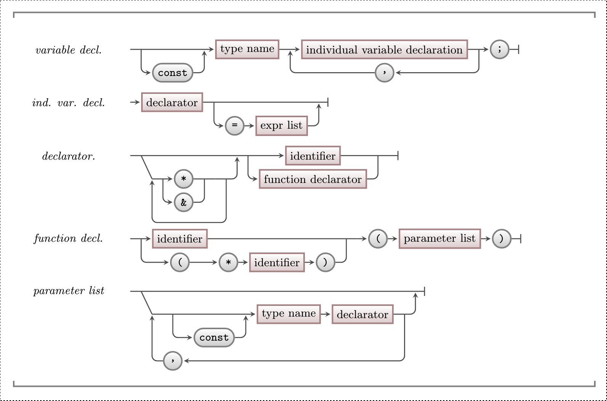

import Carousel from '/src/components/Carousel.astro'

We understand now how each variable exists at some location in memory, and a pointer is a variable that "points" to one of these location (addresses).

However, we've also noted previously that functions and procedures exist in memory too, and have their own addresses. Whenever we call a function/procedure/method, the program counter jumps to that _address_, and executes the code there.

It is because of this that we can also make pointers that point to _functions_. An example will make why this is interesting clearer:

```c++ {17, 20-21, 24-25}
#include "splashkit.h"

// Two functions with the same signature (aside from names)
void say_hello()
{
    write_line("Hello!");
}
void say_bye()
{
    write_line("Bye!");
}

int main()
{
  // Declare a function pointer,
  // for functions that look like: `void function_name();`
  void (*my_function_ptr)();

  // Assign say_hello to my_function_ptr, then call it
  my_function_ptr = say_hello;
  my_function_ptr();

  // Same for say_bye
  my_function_ptr = say_bye;
  my_function_ptr();
}
```

### Function Pointers - Why, When, and How

Function pointers allow us to begin treating _functions_ as a kind of _data_. We can now "store" a function to use later, pass a function as a parameter, and even return functions. We won't often _need_ to use this, but it opens up a number of new ways we can structure our programs.

In the example above, see how we were able to store the address of a function into `my_function_ptr`, and then call it later? This makes the _choice_ of function something we can control as data. See the example later on for how we might pass a function, into a function.

## In C/C++
:::tip[Syntax]

This syntax shows how function pointers can be declared in C/C++.


_I'd recommend checking the examples below, it looks a bit odd..._

:::

### Declaration
Declaring function pointers in C/C++ is one of the more confusing pieces of syntax. One of the ideas behind C and C++'s design is that "_declaration_ should look like _usage_". We can see this in much of the syntax we've used so far:
```c++
int var;  // declaring an int variable
var = 10; // assigning an int variable

int *ptr;   // declaring an int pointer
ptr = &var; // assigning the int pointer
*ptr = 10;  // dereferencing the pointer and assigning to it

int func(int var);// declaring a function
func(var);        // calling a function
```

Function pointers continue with this pattern, like so:
```c++
int (*func_ptr)(int); // declaring a function pointer
func_ptr = rnd;       // assigning a function pointer
func_ptr(10);         // calling a function pointer
```
There are three things of note here:
1. The function pointers include the _return_ type of the function, _and_ the types of the parameters. They will only store addresses of functions that match that signature exactly (ignoring names).
2. The variable's name becomes wrapped in `(* <name>)` - for instance `(* my_func_ptr)` - we have to start reading this from the inside out (see below for a slideshow)
3. We _don't_ have to use `&` and `*` with function pointers!

:::tip[Why not?]

C/C++ handles this in an interesting way - functions/procedures actually get converted to pointers whenever we do anything with them. For instance, `write_line("Hello!")` automatically becomes, and is _identical_ to, `(&write_line)("Hello!")`.

That's right, it's using the _address_ of the function, and executing the code at that address! So C++ is happy to automatically convert functions to pointers _without_ us even using the `&` operator.

This applies when assigning functions to them:
```c++
// both of these work
func_ptr = write_line;
func_ptr = &write_line;
```
and when calling them:
```c++
// both of these work
func_ptr("Hello!");
(*func_ptr)("Hello!");
```

:::

:::tip[How do I read function pointers?]
C/C++'s way of declaring variable pointers can be difficult to read! Let's see how it works when declaring variables - the logic is the same for parameters:
<Carousel>
{/*`
<div>
```c++ "int"
int a;
```
The `int` here, is the type which the variable we are declaring _evaluates_ to when used. When we _use_ `a`, it's an `int`.
</div>
<div>
```c++ "int"
int *a;
```
Even when declaring a pointer, `int` maintains the same role - when we use the `a` by _dereferencing_ it (`*a`), it evaluates to an `int` type.
</div>
<div>
```c++ "int "
int (*a)(int, int);
```
And same for a function pointer! The `int` is still what the function would return when used by _calling_ it...
</div>
<div>
```c++ "(int, int)"
int (*a)(int, int);
```
...But of course we also have to say what parameters the function takes, so these go after the identifier.
</div>`*/}
<div>
```c++
int (*a)(int, int);
```
We can read this from the inside out, like a spiral.
</div>
<div>
```c++ "a"
int (*a)(int, int);
```
Our variable name is `a`...
</div>
<div>
```c++ "*"
int (*a)(int, int);
```
...and it's a pointer...
</div>
<div>
```c++ "(int, int);"
int (*a)(int, int);
```
...to a function that takes two `int`s...
</div>
<div>
```c++ "int "
int (*a)(int, int);
```
and returns an `int`.
</div>
<div>
```c++
string (*my_ptr)(const book&, int);
```
See if you can understand this declaration by following the same rules :)
</div>
</Carousel>
:::

### Readability and Type Aliases
One way to make function pointers more readable, is to use [type aliases](/book/part-2-organised-code/2-structuring-data/5-reference/03-00-type-declaration/#example) to give them a new name. For instance, in both C and C++, we could use a `typedef` like so:
```c++ {3,12}
// Create a type alias called `simple_procedure_ptr`,
// that is equivalent to the type void (*)()
typedef void (*simple_procedure_ptr)();

void a_function()
{
    write_line("I was called!");
}

int main()
{
    simple_procedure_ptr my_function_ptr = a_function;
    my_function_ptr();
}
```

A C++ only equivalent that is more readable is to use a `using` statement:
```c++ {1}
using simple_procedure_ptr = void (*)();
// rest is the same...
```

## Example
In this example, we write a function, that _takes_ a function as a parameter, and calls it with different values.

```c++
#include "splashkit.h"

// Prints the message, prepended with "Message:"
void simple_print(string message)
{
    write_line("Message: " + message);
}

// Prints the message in UPPERCASE surrounded by "===="
void title_print(string message)
{
    write_line("====" + to_uppercase(message) + "====");
}

// Prints the message in lowercase, with "~" between each character
void strange_print(string message)
{
    string lowercase = to_lowercase(message);

    write("~");
    for(int i = 0; i < lowercase.size(); i ++)
    {
        write(lowercase[i]);
        write("~");
    }

    write_line();
}

// Calls the function passed in with four messages
// Accepts functions with the signature:
// void <name>(string);
void print_messages(void (*func)(string))
{
    func("Hello!");
    func("Another message!");
    func("Function pointers are fun!");
    func("Hopefully!");
}

int main()
{
    // Calls print_messages three times,
    // and passes in different functions each call
    print_messages(simple_print);
    print_messages(title_print);
    print_messages(strange_print);
}
```
