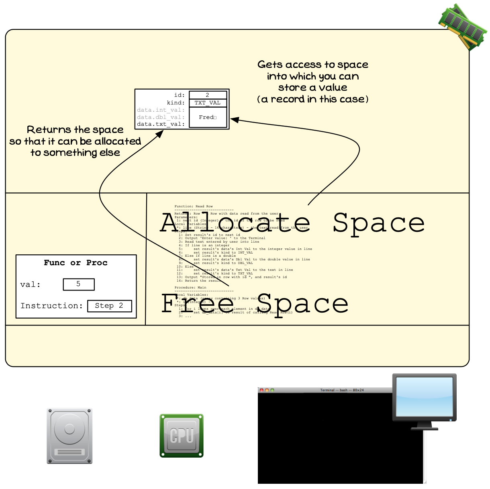

## Allocating memory on the heap

Dynamic memory allocation is performed with a couple of operations that will be provided by the programming language you are using. These operations allow you to do the following:

- **Allocate Space**: You ask the operating system to allocate you some space that will then be assigned to your program, and you can use to store data. The operating system will then allocate you space on the heap that is large enough to store the value you require.
- **Free Allocation**: When you have finished using a piece of memory you have been allocated on the heap, you need to release this so that the operating system can allocate it to others.

These are the two basic actions that exist for performing dynamic memory management. Basically, you can ask for memory, and you can give it back. Once you have been allocated space, that space will be reserved for your use until you free that allocation, or your program ends. So it is important to remember to free the memory you have been allocated when you no longer require it.

You can ask for space, and return the space you were allocated
 

:::note

- [Figure x.y](#FigureAllocateHeapMemory) shows the idea behind the two operations.
- You can ask to be allocated space, this will give you access to a space on the heap. You can then use this to store a value.
- You can tell the Operating System when you are finished with the space, so that it can allocate it to something else.

:::

## Allocating _objects_ on the heap

In earlier languages such as C, the two operations above are the main ways you manage dynamic memory. We will look at them in more depth in the [next chapter](/book/part-2-organised-code/7-deep-dive-memory/0-overview/), but for now let's see how C++ handles it.

In C++, the operations are framed differently. Rather than allocating raw chunks of more memory, you create and delete _objects_ instead. Many other modern languages also handle it in a similar way.

We will explore this on the [next page](/book/part-2-organised-code/6-indirect-access/5-reference/02-01-new-delete/).

## The Heap - Why, When, and How

You use the heap and dynamic memory allocation when you want more flexibility than is offered on the stack. You may want to have an array where you can change it size, or you may want to load and work with a large amount of data. In these cases, the stack won't work, so you need to move into the heap.

The general pattern will be to allocate space, and store the address of this space in a pointer. You can then work with that space, accessing it via the pointer, before freeing it when you are done.

As you work through this you need to be able to start picturing the data on the heap, as well as the values you have on the stack. Remember that we are creating digital realities here, so you now need to picture that reality coming into existence you make space for it on the heap. You can connect these things that you are building using pointers, and interact with it in your code. These pictures will be harder to see is you look just at the code, and this is why it is so important to know how to think and picture these things you are creating.

We will explore all of this as we progress through this chapter.
