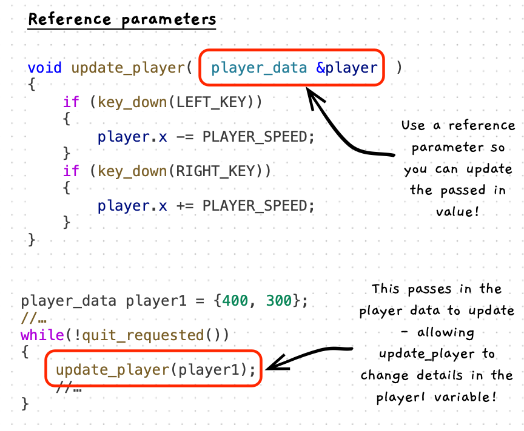

On the first pass through this chapter, the main thing to start to explore using are reference parameters. These allow you to create parameters which are used to update the passed in values.



:::note

- This is called pass-by-reference
- Use it to allow changes to the parameter to affect the variable argument
- You must pass a variable to a reference - it cannot be a calculated value as the parameter needs to be able to write the result back to somewhere in memory.

:::

## Example

The following example uses pass by reference to allow `update_player` to change the values in `player1`, and to efficiently pass the `player_data` into `draw_player`.

```cpp
#include "splashkit.h"

struct player_data
{
    double x;
    double y;
};

const double PLAYER_SPEED = 3;
const double PLAYER_RADIUS = 10;

void draw_player(const player_data &player)
{
    fill_circle(color_blue(), player.x, player.y, PLAYER_RADIUS);
}

void update_player(player_data &player)
{
    if (key_down(LEFT_KEY))
    {
        player.x -= PLAYER_SPEED;
    }
    if (key_down(RIGHT_KEY))
    {
        player.x += PLAYER_SPEED;
    }
}

int main()
{
    player_data player1 = {400, 300};

    open_window("Pass by reference test", 800, 600);

    while(!quit_requested())
    {
        process_events();
        update_player(player1);

        clear_screen(color_white());
        draw_player(player1);
        refresh_screen(60);
    }
    return 0;
}
```
