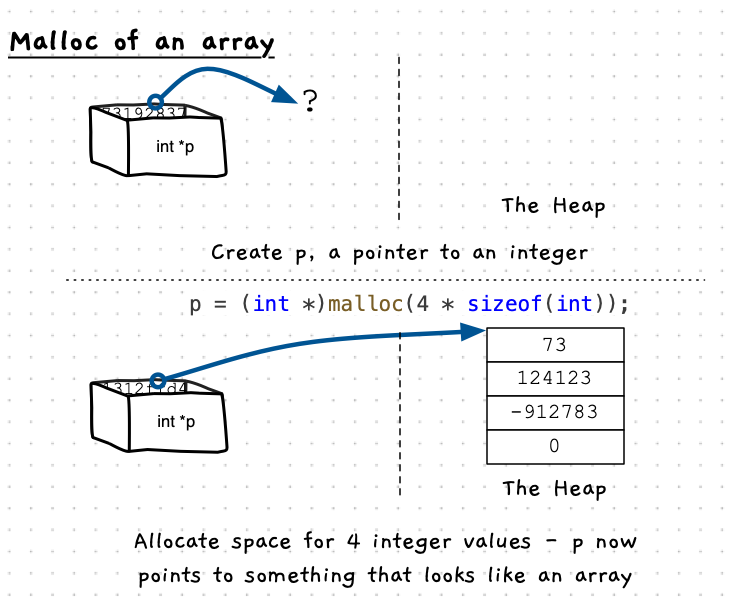

You can also use `malloc` to give you space for more than one value, and then you can treat the pointer like an array. 


:::note

Pointers are not arrays. The C language lets you treat a pointer like it is an array. In which case, it will use the index to jump forward in memory and access the data as if it were an array.

:::



## Example Code

The following code allocates space for an array of doubles, initialises some and then prints all values.

```cpp {8,11,21,22,26-29}
#include <stdlib.h>
#include "splashkit.h"

using std::to_string;

int main()
{
    const int SIZE = 10;

    // Allocate memory for an array of doubles on the heap
    double *ptr = (double *)malloc(SIZE * sizeof(double));
    
    // Check if memory allocation was successful
    if (ptr == NULL)
    {
        write_line("Memory allocation failed");
        return 1;
    }
    
    // Assign a value to the allocated memory
    ptr[0] = 73.37; // or *ptr = 73.37;
    ptr[1] = 42.0;
    //...
    
    // Print the value
    for(int i = 0; i < SIZE; i++)
    {
        write_line("Value at index " + to_string(i) + ": " + to_string(ptr[i]));
    }
    
    // Free the allocated memory
    free(ptr);
    ptr = NULL;
    
    return 0;
}
```
