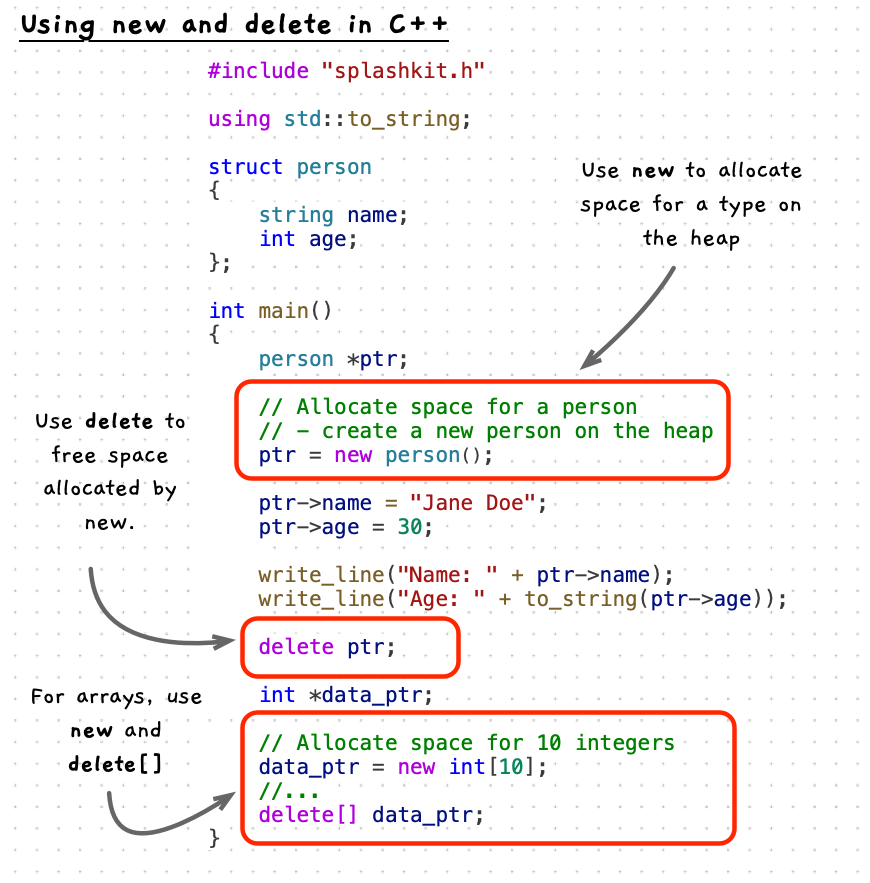

What we have looked at so far are the lower level, C functions for allocating and freeing memory. C++ includes a number of features that we will explore in [Member Functions](/book/part-2-organised-code/4-member-functions/0-overview) that impact memory management. As a result, you should use the following C++ functions when working with dynamic memory involving C++ types (such as `string`). These are not quite as flexible as the C functions, and there are ways of mixing these together as underneath they are both using the same operating system features - with the C++ versions building on top of the C functions.

In C++ you use the `new` operator to allocate space on the heap for a type. You follow the `new` keyword with the name of the type to create. C++ will work out its size and allocate the space for you, as well as ensuring that the space is initialised correctly for that type. You can allocate space for individual values, or for multiple using an array type.

Use `delete` or `delete[]` to free an allocation made with `new`. `delete` will free an individual value, while `delete[]` will free an array of values.

Unlike C, C++ does not support the ability to re-allocate space. Instead, you are encouraged to use types in the library that implement this for you. However, you can do this yourself but you have to take care of correctly initialising and destroying data. This is something we explore in the detailed [C++ memory allocation](/book/part-2-organised-code/7-deep-dive-memory/5-reference/09-new-delete) page.
