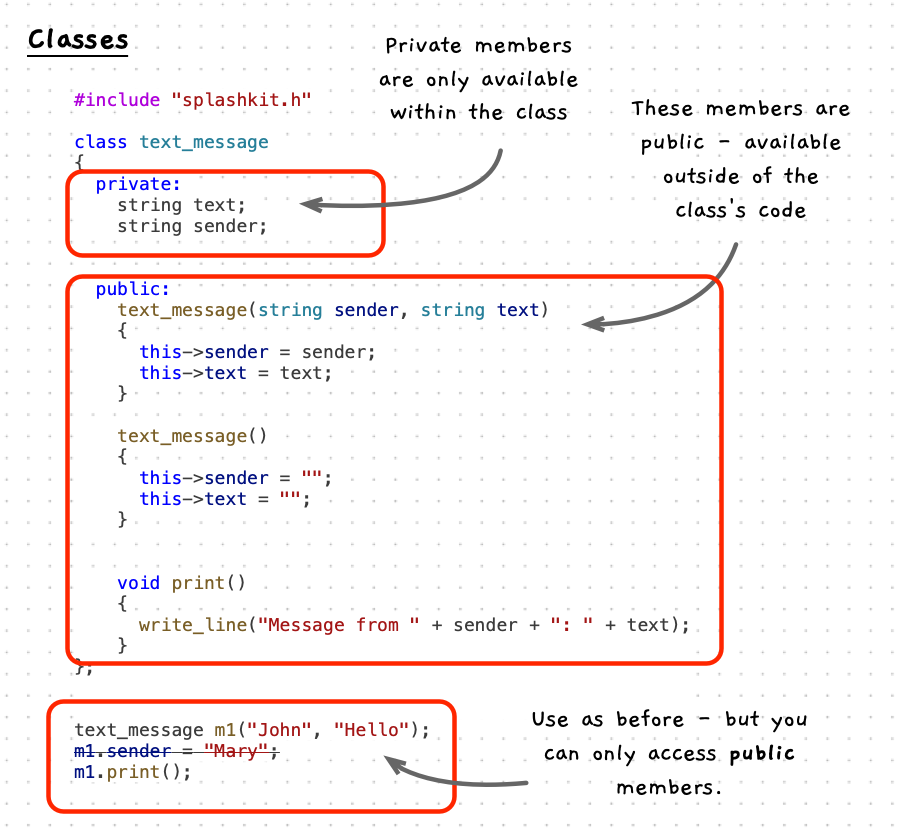

In C++ member functions on structs were actually provided mostly for backward compatibility. Instead, when we shift to object-oriented programming, we should now code our entities in **classes**. In C++, classes and structs are almost identical, so switching to classes now should not be too difficult. This shift will be important, as most modern languages only provide classes.

*So what is the difference?*

As with structs, classes can have fields, member functions, and constructors. The only difference is that with a class, members are *hidden* so they are only accessible by the class's code. So you cannot access these members from code outside the class.

This comes from our change of perspective - we now call things on the entity, rather than passing the entity around to different functions/procedures. Given this change, we no longer need, or want, everything to be accessible outside the entity. This then gives you, the developer, the opportunity to say "you can access this" and "you can't access that". This makes it easier to ensure things are used correctly.

To control access, C++ give you two keywords you can place within a class or struct. You use `private:` to start a section of code where members are hidden, or you use `public:` where you want to give access to the following members.



:::note[Classes]

- are just like structs!
- hide their fields and member functions from the code outside the class.
- can include `public:` sections where the following members are visible outside the class. (the default for structs)
- can include `private:` sections where the following members are hidden inside the class. (the default for classes)

In the above illustration:

- We have explicitly made the fields private.
- The constructors and print method are public - available for others to use/call.
- `m1` uses the public constructor to initialise its data.
- We cannot access `m1.sender` in main - that is outside the class and from there you cannot *see* or *access* these fields.
- We can print, as that method is public.
- Notice that inside the class we can access public or private members.

:::

## Example

The following example implements the `text_message` using a class. The highlighted lines are the only changes! Though, we could no longer access the `text` and `sender` fields outside the class's code. So `main` could not read or change these values.

```cpp {10,13,18,22-23}
#include "splashkit.h"

/**
 * @class text_message
 * @brief Represents a simple text message with a sender and message text.
 * 
 * @field text The content of the message.
 * @field sender The sender of the message.
 */
class text_message
{
  /**
   * The content of the message. This is now private!
   */
  string text;

  /**
   * The sender of the message. This is now private!
   */
  string sender;

  // Things from here on are public now...
  public:
    /**
     * @brief Constructs a text_message with the given sender and text.
     * 
     * @param sender The sender of the message.
     * @param text The content of the message.
     */
    text_message(string sender, string text)
    {
        this->sender = sender;
        this->text = text;
    }

    /**
     * @brief Constructs an empty text_message with no sender or text.
     */
    text_message()
    {
        sender = "";
        text = "";
    }

    /**
     * @brief Prints the message in the format: "Message from <sender>: <text>"
     */
    void print()
    {
        write_line("Message from " + sender + ": " + text);
    }
};


/**
 * @brief Entry point for the message program. Demonstrates usage of
 * the text_message class.
 */
int main()
{
  // Notice... this is all the same!

  text_message m1("John", "Hello");
  text_message m2("Mary", "Hi");
  text_message m3("John", "How are you?");
  text_message m4("Mary", "I'm good thanks");
  text_message m5;

  
  m1.print();
  m2.print();
  m3.print();
  m4.print();
  m5.print();
  
  text_message *m6 = new text_message("John", "I'm glad to hear it");
  m6->print();
  delete m6;

  return 0;
}
```

:::tip
It is generally good practice to have fields private, then you can give controlled access to interact with these through member functions.
:::
