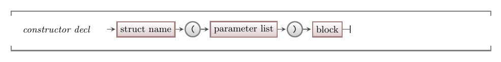

The constructors are probably the trickiest of the members to consider, but let's start with them anyway as we need to see how objects (struct values) are initialised before we start to perform other actions on them.

A constructor is a special method that is used to initialise an object created from the struct. This is called in one of two ways:

1. When a struct variable is declared.
2. When the **new** keyword is used to create an object on the heap.

## Constructor - Why, When, and How

When you start to work more within the struct, it is probably always a good idea to create a constructor that can initialise everything just the way you want. This can accept parameters, and use the provided values to set fields of the object when it is created, or it can just allocate default values that make sure things work as expected. In any case, the idea is to make sure that each object is always set up in a way that will mean it works straight away.

In our example code, the `new_contact` function performed the same role in the original struct code. This can be coded into the constructor in our contact. This will initialise each object created from the struct, ensuring that it always has valid data within it. The great thing with the constructor is that it can be used to initialise values on the stack and on the heap, which our original `new_contact` function could not do.

:::tip[Object?]

Remember that the term **object** refers to a value created from a struct. We use this when thinking about these values as they now *know* and *can do* things based on the fields and methods declared within the struct. In this way the struct is like the template, and the object is created in memory using this template. In C++ objects can be allocated on the stack or on the heap.

:::

## Destructors

Similar to constructors, you can also hook into the code that occurs when the object is destroyed. This may occur when a stack based object goes out of scope, or when you explicitly `delete` an object from the heap.

You would use the code in the destructor to clean up any additional memory, or other resources, allocated to your object.

## In C++

:::tip[Syntax]

Constructors are coded in the struct as a special looking function. It does not specify any return type, and it uses the same name as the struct for its function name. Destructors are similar, but start with a `~` and can not have any parameters.



:::

### The new and delete keywords

C++ also include a **new** keyword that can be used to create an object (allocate memory for it on the heap) and **delete** to remove the object (free that memory). `new` is given the name of the type of object to create, and will allocate space on the heap for that object, and call the matching constructor to ensure it is initialised. You can then use the object to perform the tasks you need. When you are finished, you free the memory using the `delete` keyword, and passing in a reference to the object.

:::tip[Syntax]

The new keyword will create an object on the heap and return a pointer to it. You need to store that somewhere so that you can refer to the object and get it to do things. When you are finished with the object, you can delete it which frees it from memory.


Remember that `new` creates an object from a struct, and `delete` must then be used to delete that object.

:::

## Example

Here is another example of a struct with some fields, a constructor, and a method.

```cpp
#include "splashkit.h"

using std::to_string;

struct stock
{
    // The fields are created in the struct, so they are directly accessible
    // within the struct itself.
    string id;
    int value;

    /**
     * The constructor initialises the stock with
     * the supplied id and value.
     *
     * @param id_init the id to initialise the stock with
     * @param value_init the value to initialise the stock with
     */
    stock(string id_init, int value_init)
    {
        // We are inside the struct - so we can access id and value
        id = id_init;
        value = value_init;
    }

    ~stock()
    {
        write_line("Stock destroyed - " + id);
    }

    /**
     * Adjust the value by the indicated amount.
     *
     * @param diff the amount to change the value by
     */
    void adjust_value(int diff)
    {
        // We can update the value of the struct
        // methods are always run on the stock object itself...
        value += diff;
    }

    void print()
    {
        write_line(id + " $" + to_string(value) );
    }
};

int main()
{
    // We can use new to allocate stock on the heap
    stock *s1 = new stock("TEST", 123);
    
    s1->adjust_value(-4);
    s1->print();

    delete s1;
    s1 = nullptr;

    // This also works with a stack allocated stock
    stock s2("Test", 123);
    s2.adjust_value(-4);
    s2.print();

    return 0;
}
```

When you look at this, notice that the combination of `new` and the constructor perform the same steps as we had previously coded within something like a `new_stock` function. The `new` takes care of the memory allocation and the constructor takes care of initialising the data within the value created.

Notice in the above code that you can also use the constructor for stack allocated stock. The syntax for this is a little strange, and makes the variable declaration look like a function call. You have to remember that in these cases you are calling the constructor. In this case, you *have to* call the constructor as there is not a constructor with no parameter (which is also known as the **default constructor**). If you want to be able to declare a stock variable without having to pass in the stock id and value, then you can add a second constructor that takes no parameters and initialises the id and value to some set defaults.

<!-- TODO: add slider -->

