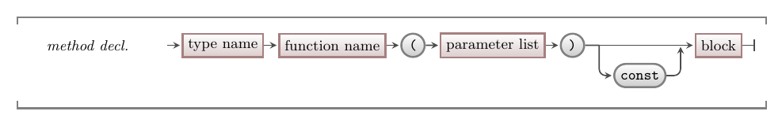

Method are functions or procedures that are declared within the scope of a struct. This is similar to our existing functions and procedures where we had passed a reference or pointer to the struct in as a parameter. Now, with the method declared within the struct, it will have direct access to the fields and other methods without needing additional parameters.

## Methods - Why, When, and How

Moving your functions and procedures into the struct allows you to connect the data and its functionality. You can start to see these as the think that the struct *can do*, with the fields being things the struct *knows*. This can be a really powerful idea, and lets you think about these things in new ways. For now, we can focus on the mechanic and the way this really helps organise your code even more than when the functions and procedures were separate. Moving them into the struct means that you can easily find all the things the struct can do - which is so much easier than having to search through all the different functions and procedures within your code. For small projects this is ok, but as your projects grow using methods will become more and more useful as the number of structs you have and the number of things that each struct can do will both grow over time.

## In C++

:::tip[Syntax]

The C++ syntax for a method declaration is the same as a function or procedure declaration, but occurs within the context of a struct.



The `const` between the end of the parameter list and the start of the block can be used to indicate that the method does not change the struct's data. This is similar to the case where you would have passed the struct as a `const` pointer or `const` reference to the function or procedure. As there is no parameter to capture the current object, you place the `const` after the parameter list and it applies to the object itself.

:::

### Using this to access the current object

In some cases, you will need to access the current object within a method or constructor. With functions and procedures, we always needed to access any struct values via the parameter variable. In the case of methods, we are *within* the struct, so there is no visible identifier that refers to the struct itself.

To achieve this, C++ added a `this` keyword which is a pointer to object upon which the method was called. You can use `this` when you need to pass the current object as an argument to a function, procedure, or parameter or when you need to access a field or method where there is another variable in the scope with the same name.

## Example

The following example creates a die struct, which represents a single dice from a board or roll playing game. If we picture a die, it will need to *know* how many sides it has, and its current value (the one on top when rolled). We then need a method to *roll* the dice, and we can use a method to access the current value.

```cpp
#include "splashkit.h"

using std::to_string;

/**
 * A die is a struct that represents a single dice object 
 * with a given number of sides. The die can be rolled, and the 
 * current value of the die can be retrieved.
 */
struct die
{
  // The number of sides on the die
  unsigned int sides;

  // The current value of the die
  int value;

  /**
   * Creates a new die with the given number of sides.
   * 
   * @param sides The number of sides on the die.
   */
  die(unsigned int sides)
  {
    if ( sides < 1 )
    {
      sides = 1;
    }

    // store in sides in current object
    this->sides = sides;
    this->value = 1;
  }

  /**
   * Rolls the die, generating a new value.
   */
  void roll()
  {
    value = rnd(sides) + 1;
  }

  /**
   * Returns the current value of the die.
   * Const here indicates that this method does not change the die.
   * 
   * @return The current value of the die.
   */
  int current_value() const
  {
    return value;
  }
};

int main()
{
  die *d = new die(6);

  for(int i = 0; i < 10; i++)
  {
    d->roll();
    write_line("Dice value: " + to_string(d->current_value()));
  }

  delete d;

  return 0;
}
```

Notice how in the code we need to use `this` in the constructor as the `sides` parameter has the same name as the `sides` field. This is a good example of when the `this` keyword can come in handy. We cannot directly access the `sides` field, as the compiler will assume we mean the parameter if we use the `sides` identifier. Make it `this->sides` tells the compiler to look at the `sides` field within the current object (`this->`).
