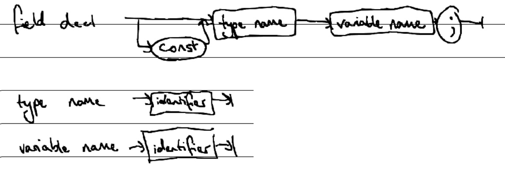
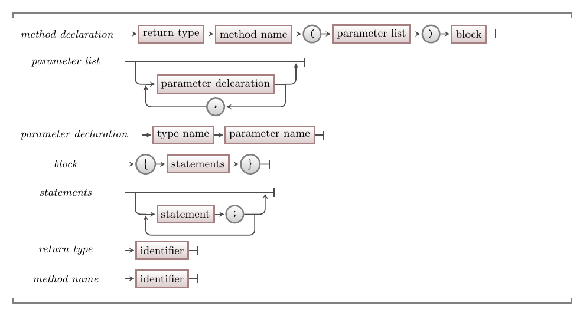
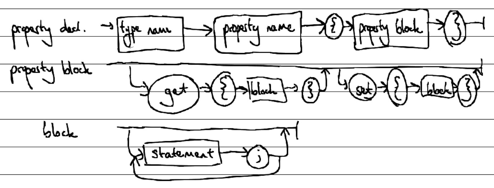

## A new approach to organisation

Sometimes it's not enough just to organise the logic of our code into [methods](<../../../2-organising-code/0-overview/>), and the data in our code into [custom data types](<../../../3-structuring-data/0-overview/>).
**Classes** are a tool we can use to combine these ideas and organise our code into *entities* that contain data and methods.
A class acts a *blueprint* for an entity, defining what the entity **knows** (data) and what it can **do** (methods).
Once we have described an entity as a class, we can use that class as another kind of **custom data type** in our programs.

Classes are powerful, because they allow us to organise our code differently to any other tools we've added to our toolkit so far.
Because they are so different, classes also require us to *think* differently about how we design digital realities.
This can be a big shift, so for now we will focus on what classes are and how they work.
In [Part 3](../../../../part-3-programs-as-concepts/00-part-3-programs-as-concepts) we will explore how to make decisions about using them.

## The elements of a class

Figure X shows a sketch of the **class** concept.
A class describes a group of **responsibilities**, which can either be **knowing** something, or **doing** something.
Just like a [program](<../../../../part-1-instructions-1-sequence-and-data/1-concepts/00-program>), a class may use methods and data from one or more libraries.
A class may also use methods and data from one or more other classes.
We will explore this further in [Part 3, Chapter 3](<../../../../part-3-programs-as-concepts/3-collaboration-encapsulation/0-overview>) with the concept of **collaboration**.


<div class="caption"><span class="caption-figure-nbr">Figure X: </span>A class describes an entity that knows things and can do things</div><br/>

A class can have a lot of responsibilities, but each one will relate to either knowing something, or doing something.
Let's explore the kinds of knowing and doing responsibilities a class can have.

### Knowing responsibilities

#### Every class has a name

The first thing a class needs to know about is its name or **identifier**.
As with the other kinds of identifiers we've encountered, a class's name needs to be unique, meaningful, and concise.

We use a class's name in a few ways.
The first use is when organising the code files on our computer.
Typically, the syntax for a class is in its own file, and that file is named with the class's identifier.
This makes it easy to find the code for our class definitions when we need it.

The second way we use a class's name is in our code.
Because a class is only a blueprint that describes responsibilities, we need a way to use that blueprint to create entities.
We do this through a special method called a **constructor**, which has the same identifier as the class it constructs.
As construction is a doing responsibility, this concept will be explained in the next section.

The last way we use a class's name is also in our code.
A class is a custom data type, so its identifier can be used in the same ways as any other data type identifiers, such as when declaring variables or defining method parameters.

#### Classes can know about data

A class stores data in **fields**.
Fields are also called **class variables**, because they have a lot of similarities with the concept of a [variable](<../../../../part-1-instructions/1-sequence-and-data/1-concepts/07-variable/>).
Just like a variable, every field has a data type, an identifier, and a value.
Most fields are **variable**, meaning their value can be changed.
It is also possible for a field to be **constant**, in which case the value can only be set once.

The key difference that makes fields a new concept is their scope.
Fields are accessible anywhere within the class where they are defined.
That means a field can be accessed and modified (assuming it is not constant) within any of the methods in the same class.
This is one of the concepts that makes classes powerful, as it allows us to share data between methods without needing parameters.

### Doing responsibilities

#### Every class can be constructed

Just like a method doesn't do anything until it is called, a class doesn't do anything until it is used to create an entity.
To do this, we call the class's **constructor**.
A constructor is a special method with the same identifier as the class it relates to, which creates and returns an **instance** of the class.

The constructor's job is to make sure all of the data in the class is initialised.
It can do this on its own, by using values passed in as arguments, or a combination of both.
A class can have multiple constructors using method [overloading](<../../../../part-1-instructions/1-sequence-and-data/1-concepts/03-method-call/#overloading>), which means programmers can write several different ways of initialising a class's data.

Once we have an instance of the class, called an object, we can write code asking it to do things or asking it about the things that it knows.
This is something we will learn more about when we explore the concept of an [object](<../1-objects.md>).

#### Classes can do things

As well as its constructor, a class can have any number of methods.
Methods inside a class are very similar to regular methods: they still have an identifier, can have parameters, and can return a value.
Within a class we can also [overload](<../../../../part-1-instructions/1-sequence-and-data/1-concepts/03-method-call/#overloading>) methods, just like we can with regular methods.
The only real difference between regular methods and methods that are inside a class, is that all methods within a class can automatically "see" each other.
This means that all methods within the same class can call each other.

### Showing and hiding responsibilities

Once we have used a class to create an entity, we can write code to access the data within the entity and execute its functionality.
However, we often don't want our entities to allow just any code to do this.
This is where the concept of **access modifiers** helps us.
An access modifier is a piece of information attached to every field and method within a class, telling the compiler what code can access the field or call the method.
There are several access modifiers we can use, but for now let's focus on the two most basic ones: **public** and **private**.

* **Public** methods and fields in a class can be accessed by any code that has an instance of the class, including within the class itself.
* **Private** methods and fields in a class can only be accessed by other code in the same class.

Deciding what access modifier a field or method should have is one of the things that makes coding with classes challenging.
There are principles and best practices to help make these decisions, which we will explore in [Part 3](<../../../../part-3-programs-as-concepts/00-part-3-programs-as-concepts>).

## In C#

### Class structure

:::tip[Syntax]
The syntax for a C# class declaration is shown in Figure X. The syntax for declaring each of the elements of a class are shown in other diagrams below.

If you are wondering what a property is because you are seeing that term for the first time in this diagram, don't worry!
Properties are specific to the C# programming language, so we have not included them in our explanation of standard class elements.
We'll explain what they are below.


<div class="caption"><span class="caption-figure-nbr">Figure X: </span>The syntax for class declarations</div><br/>
:::

A class declaration starts with the word `class`.
This tells the compiler that the following code defines a class.
The **class name** is an identifier, which can be any valid C# identifier that has not be used for any other classes in the same scope.

The **class block** contains all of the declarations for the class's fields, constructors, methods, and properties.
Each declaration defines a **class member**, and starts with an **access modifier**.
For now, an access modifier can be either `public` or `private`, and we'll expore other access modifiers in Part 3.

There are no limitations in the C# syntax to force you to declare the different members of your class in a specific order.
However, there are some general conventions that C# programmers typically follow:

* Fields are declared first, with constant fields before variable fields.
* Constructors are declared after fields.
* Other methods are declared after constructors.

:::note
These general conventions obviously don't cover every possible case.
Defining a standard ordering is the subject of much debate amongst programmers, and as you write and read more code you will form strong opinions of your own!
:::

### Field Declarations

:::tip[Syntax]
The syntax for a field declaration in a C# class is shown in Figure X.


<div class="caption"><span class="caption-figure-nbr">Figure X: </span>The syntax for field declarations</div><br/>
:::

Hopefully the syntax for declaring a field looks familiar, because it is the same as the syntax for declaring a variable. <!-- TODO: link to variable concept -->
Typically, we declare our fields at the top of our class definition, and then initialise their values inside the class's constructor.

:::caution[Reminder]
Remember that **fields** are also called **class variables** -- there is no difference between the two concepts.
:::

### Method Declarations

There are two kinds of methods that we can define in a class: **methods** and **constructors**.<sup>[1](#FootnoteEntities)</sup>
Let's take a look at the syntax for each.

:::tip[Syntax]
The syntax for declaring a constructor in a C# class is shown in Figure X.


<div class="caption"><span class="caption-figure-nbr">Figure X: </span>The syntax for constructor declarations</div><br/>
:::

:::tip[Syntax]
The syntax for declaring a method in a C# class is shown in Figure X.


<div class="caption"><span class="caption-figure-nbr">Figure X: </span>The syntax for method declarations</div><br/>
:::

The first thing you might notice is that the syntax is practically identical!
There are really just two main differences between a constructor declaration and a regular method declaration:

1. A constructor does not have a unique method name. It has to use the class's name.
2. A constructor does not have a return type.

Using the class's name in place of a method name tells the compiler to interpret the declaration as a constructor rather than standard method.
The reason that a constructor declaration does not need to include a return type is because a constructor, by definition, can only and always will return an **instance** of the class.
Therefore, its return type is implied and does not need to be explicitly stated.

Aside from these two differences, a constructor declaration is the same as a method declaration.
The syntax for a method declaration is hopefully looking familiar, because it is the same as the syntax for declaring methods you have already seen. <!-- TODO: link back to method declaration concept -->

<hr class="footnote">
<div id="FootnoteEntities" class="footnote"><sup>1</sup>Yes, it is confusing that a constructor is a method, but also a separate concept!</div>

### Property Declarations

**Properties** are a class element we have not explored yet.
The reason for this is that properties are unique to C#.

Essentially, properties are a way of adding an element to a class that *looks* and *acts* like a public field to other code, but is not *actually* a public field.

:::tip[Syntax]
The syntax for declaring a property in a C# class is shown in Figure X.


<div class="caption"><span class="caption-figure-nbr">Figure X: </span>The syntax for property declarations</div><br/>
:::

The start of a property declaration looks exactly like a field declaration: an access modifier followed by a data type and a name.
Then, within curly braces you can declare up to two parts of the property:

1. A `get`, which contains code that is executed when the property is *read*.
2. A `set`, which contains code that is executed when the property is *assigned to*.

Both parts are optional, but can only be used once each in a property.
A property containing only a `get` part is called a **read-only property**, and a property containing only a `set` part is called a **set-only property**.
A property containing both is just called a property, or can be called a **read-write property**.
Most properties are read-write or read-only.

Because `get` is used when the property is read, it must include a **return statement** which returns a value matching the data type of the property.
The `set` part of a property has access to a special variable, `value`, which has the same data type as the property and the value of the right-hand side of the assignment statement in which the property was used.

The code within a `get` or `set` can be as simple or as complicated as you like, and can call other code within the same class or in libraries.
Many properties are written as "wrappers" around a private field, and are used to better control access to the data in that field.
Other properties may instead construct and return new data when they are read.

## Example

```cs
class Greeting
{
    private string _text;

    public Greeting(string text)
    {
        _text = text;
    }

    public void PrintGreeting()
    {
        Console.WriteLine(_text);
    }

    public string Text
    {
        get
        {
            return _text;
        }
        set
        {
            _text = value;
        }
    }
} 
```

<!--
* don't need `return` in a constructor -- it's automatically done
* `value` special keyword in a property
 -->

<!--
* it's just another way of organising our code and creating our own custom data types
* we use classes as blueprints to make objects (link to next concept)
* constructors
* properties
* classes don't run in sequence (just like procedural code with methods don't run in sequence) -- call forward to the "looking inside" section?
* `this`??
-->

:::note[Summary]
summary
:::
