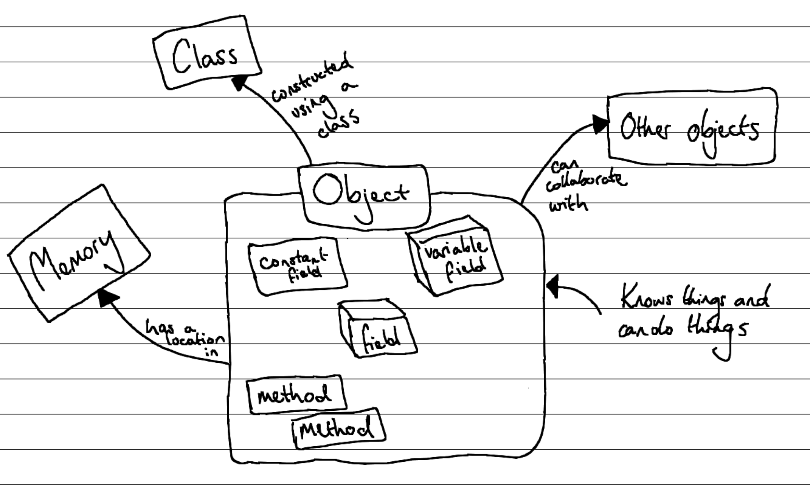

## What is an object?

Classes are a powerful tool, but on their own they don't do much to help us create digital realities.
This is because a class is just a *description* of a entity.
We need to use that description as a blueprint to **construct** an **object**.

Figure X shows a sketch of the **object** concept.
Remember that a class describes a custom data type -- an object is simply a **value** of that type.
As with any other value in a program, an object has a location in memory.
That memory is subdivided into spaces for each of the object's fields.[1](#FootnoteEntities)
These fields and their values are the **state** of the object.

Figure X: An object is an entity in memory that knows and can do things
 
<!-- TODO: remake concept diagram properly -->

Another term for an object is an **instance** of a class.
This is because the process of constructing an object can also be called **instantiating** the object.
Each instance of a class is a self-contained entity.
What this means is that although we can create multiple objects from the same class blueprint, each object we create will have its own state.
For example, if we had a "Person" class with a field "name", every instance of "Person" would have its own location in memory and its own "name" variable and value within that memory.

1In reality there is a little more to it, but we are ✨abstracting✨!

## Creating objects

You can create an object by calling the relevant class's **constructor**.
The constructor is a method that does three things:

1. Assigns space in memory for the object.
2. Executes its instructions.
3. Returns a reference to the new object's location in memory. <!-- TODO: link to section on reference/value types, and/or pointers? -->

The job of the constructor is to set the object's **initial state**.
That is, it should make sure that all of the object's fields have a sensible value.
It can do this by using literal values, values passed in through a parameter, calling constructors (i.e., if the field is of a class type), calling other methods (including methods from the class it is constructing), or a combination.

A constructor is often called as the right hand side of an assignment statement, so that the returned value can be stored in a variable.
We can then use that variable to ask the object about things it knows, and to do things it can do.

## Using an object
<!--
* but if an object is just a big blob of data and methods, how do we actually use it?
* the code in an object doesn't run in sequence (just like procedural code with methods don't run in sequence) -- call forward to the "looking inside" section?
-->

## In C#

<!-- 
* syntax for creating a new instance of an object
* syntax for using a field, assuming it's public
* syntax for calling a method, assuming it's public
* syntax for using a property (read and write), assuming it's public and has both parts
 -->

## Example
<!-- 
* class from classes concept, creating and using it
 -->

## Activities

:::note[Summary]

* Classes are used to **construct** an **objects**.
* An object can also be called an **instance** of a class.
* 

:::
