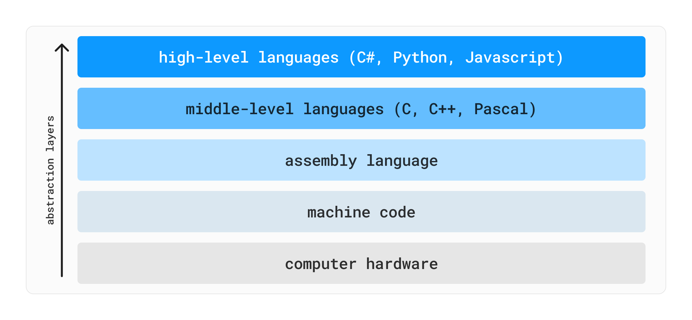

There are many ways to think about and classify programming languages. One such way to think about programming languages is in levels of abstraction. The *higher* the level of abstraction, the further away from the hardware-layer you are. The *lower* the level of abstraction, the closer to the hardware you are.

High-level languages such as Python, JavaScript and C# do a lot of heavy-lifting for you. They abstract away the details of hardware-level implementations such as memory management, bits, bytes, pointers, etc so that you can be more productive, and focus on the problems you're tring to solve. The trade-off is that you have less control or insight into what's happening under the hood, and in some cases there may be a performance penalty as the languages are doing more for you. As such, programmers may choose to use a lower-level language such as C or C++ when performance is critical.

In this chapter, we will utilise the programming constructs you've been learning to explore low-level programming in C/C++. We will look at how to write programs that interact directly with memory, bits, and bytes, and you will gain insight into how more abstracted language features such as `strings` in C# *actually* work under the hood. In fact, that's a great way to think about this chapter - we're taking a look *under the hood*.

<!-- function pointers -->
<!-- bit shifting/masking <in progress>-->
<!-- Union -->
<!-- static (C)  -->
<!-- GPIO? -->

<!-- - [Union](#): used to store one value of different possible types. -->