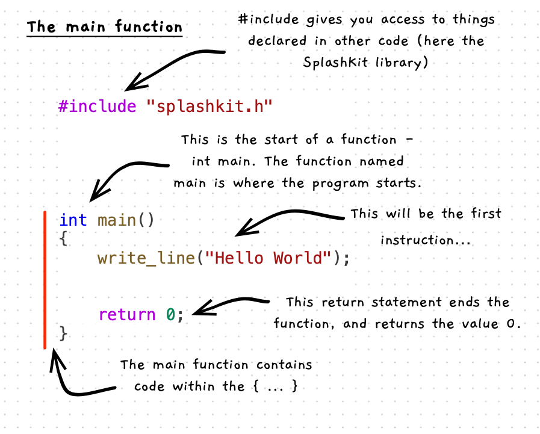

In C++ you have to place your instructions within a function or procedure. This allows you to structure your solution, which we look at in [Organising Code](/book/part-2-organised-code/1-structuring-code/0-overview). For now, we just need to create a main function.

:::note[Main...]

- is a function that contains code.
- runs when the program is started.
- should end with `return 0;`

:::

## Example

:::note

Notice how similar the code is. It includes a `main` function that contains the variable declarations and function/procedure calls. The variable declarations and function/procedure calls are similar but with different style case for the names.

:::
