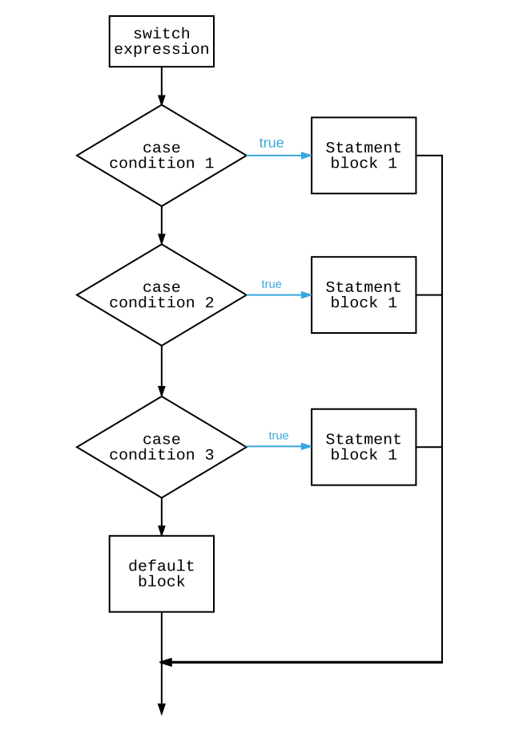

Branching statements allow you to select one of a number of path for control to move to.

By default the statements within a program are run in sequence. You can think of this as the standard **flow** of execution: with the computer moving from one statement to the next.

Control flow statements allow you to alter this standard sequential flow, adding instructions that to **branch** and **repeat** statements. This gives us three basic control flow structures: **sequence**, **selection**, and **repetition**.

Sequence is the basis for all of the program flow. The statements within a method executed in order.

### If statement

Selection, or branching, statements allow you to add places in your code where a decision is made and one of a number of paths is chosen. The most common of these if the **if statement**. Using the if statement you can choose whether some code is executed or skipped. You can also have an optional **else** branch which is run if the main branch is skipped.

For example, the following code will only print the message _if_ the value of the age variable is less than 18.

```cs
int age = Convert.ToInt32(Console.ReadLine());
if ( age < 18 )
{
  Console.WriteLine("Sorry, you must be over 18 to enter.");
}
Console.WriteLine("The end");
```


With an **else** branch, you can provide a path that is run when the condition is false.

```cs
int age = Convert.ToInt32(Console.ReadLine());
if ( age < 18 )
{
  Console.WriteLine("Sorry, you must be over 18 to enter.");
}
else
{
  Console.WriteLine("Welcome to the club");
}
Console.WriteLine("The end");
```

In each case the message `"The end"` is printed after the if statement, as this is the standard sequence. When the if statement finishes, the code proceeds to the next statement.


### Switch (or case) statement

C# also has a **switch statement** (also commonly know as a **case statement**) which allows you to use a value to jump to a selected case. For example, the following statement uses the value of the `base` variable to jump to the matching case. So, when the value of `base` is 16 the message `Hexadecimal` is printed to the Terminal.

```cs
switch(base)
{
  case 2:
    Console.WriteLine("Binary");
    break;
  case 8:
    Console.WriteLine("Octal");
    break;
  case 10:
    Console.WriteLine("Decimal");
    break;
  case 16:
    Console.WriteLine("Hexadecimal");
    break;
  default:
    Console.WriteLine($"Base {base}");
    break;
}
```


When a matching case is not found, the **default** branch is taken. So if the user entered 3, then the output would be `"Base 3"`. The default branch is optional, so if no default branch is provided then the case statement would skip all of the branches and move to the next statement.

If you start your string with a `$`, you can use braces (`$"{...}"`) within the string and it will evaluate the expression within the braces and place it at that location. This is known as **string interpolation**.

### Further reading

Read more about control flow in the following articles:

* [Making Decisions](https://www.microsoft.com/net/tutorials/csharp/getting-started/making-decisions) Microsoft Tutorial
* [Control flow ](https://en.wikibooks.org/wiki/C_Sharp_Programming/Control) in the online C# Programming text.
* [Branching](https://msdn.microsoft.com/en-us/library/hh147286(v=vs.88).aspx#Branching) in Beginning Visual C# 2010.

For help with syntax details, see this week's [syntax guide](../23-syntax-guide).

### Your Task

Which statement do you think is used more often, the if or switch statement? Why do you think that would be?

Let us know in the comments.