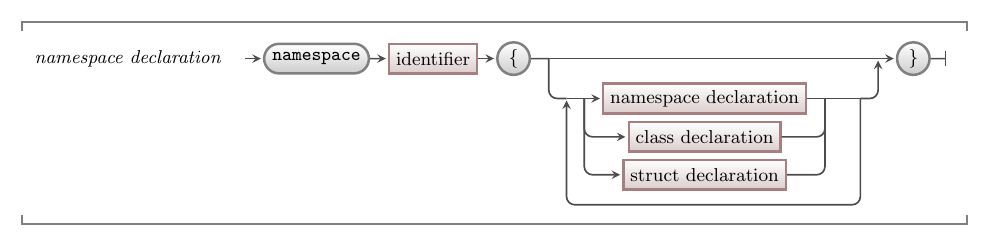

Naming things is one of the challenges with programming. This problem grows as you start to make larger programs and use libraries. The challenge is that the compiler needs unique names for everything so that it knows exactly what you are referring to at all times. This is where [scope](../../../../part-1-instructions/3-control-flow/1-concepts/02-1-scope) comes in handy, as things like local variables only exist within a confined space.

Namespaces provide a way of scoping class names, with each class having to be uniquely named within its namespace. Similarly, methods must be uniquely named within their classes.

Interestingly, namespaces can also be nested in other namespaces. This helps give you the ability to organise namespaces in a hierarchy. You access these nested namespaces using the dot operator. For example, the `System` namespace contain a `Collections` namespace. The `Collections` namespace can be accessed using `System.Collections`.

## Namespaces Why, When, and How

Namespaces are really useful when you start to build much larger programs. Namespaces are optional, so for now you can code all of your classes directly into your code files. You will, however, have to know about namespaces so that you can access classes in libraries.

## In C#

:::tip[Syntax]
You can create a namespace using the `namespace` keyword directly within your code file, or within another namespace.
The C# syntax for one is structured like this:

:::
