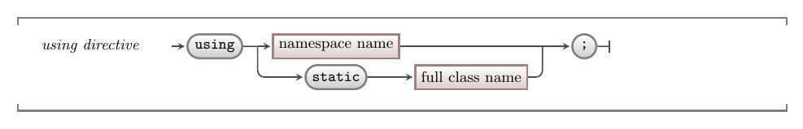

Each class has a unique name that contains its namespace and class names. For example, the `System.Collections.Generic` namespace contains a `List` class. Its name is `System.Collections.Generic.List`. Anytime you want to use this class you can access it using its full name, but this is not very convenient.

The `using` directive allows you to add a number of namespaces for the compiler to search when you use classes in the code. This means you can add a `using` directive to access the `System.Collections.Generic` namespace, then you can just type `List` and the compiler will be able to find this for you.

## Using -- why, when, and how

You are going to need to make use of classes coded within other namespaces in almost every class you create. As a result, you are likely to start every C# file with some `using` directives that will give you easy access to these classes in your code.

A version of the `using` directive can give you access to the [static methods](../4-static-methods) within a class. We used this in Part 1 when we were calling methods.

## In C#

:::tip[Syntax]
The C# syntax for a using directive is shown below. This must appear at the top of your code file before any other declarations or top level statements.



:::

## Examples

The following examples demonstrate how to code the using directive to access classes within namespaces and static methods within classes.

```cs
// Directly access classes within these namespaces
using System.Collections.Generic;
using SplashKitSDK;

// Directly access static methods within these classes
using static System.Console;
using static SplashKitSDK.SplashKit; 
```

:::note
You always have access to the classes within the current namespace, and the classes within the `System` namespace.
:::
