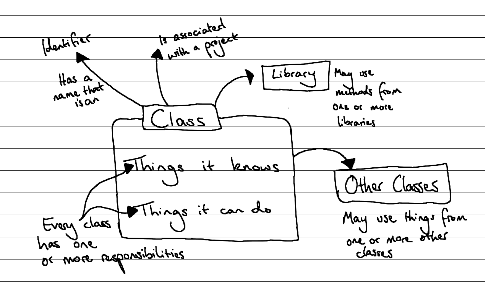
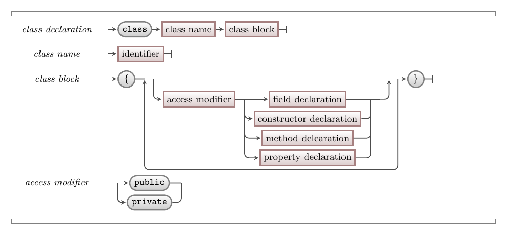

A **class** is a [type](../../../../part-2-organised-code/3-structuring-data/1-concepts/03-01-struct), so it acts a *blueprint* we use to declare variables and create values (objects). Classes are the tool we use to create our *entities*, the objects that will **know** (the data they have) and what they will be able to **do** (methods available on the objects).

Classes are powerful, because they allow us to organise our code differently to any other tools we've added to our toolkit so far.
Because they are so different, classes also require us to *think* differently about how we design digital realities.
This can be a big shift, so we need to spend time focusing on both the syntax and the new mental model.

The following image captures a visualisation of the **class** concept. The key aspects include:

- A class describes the **responsibilities**, which can either be **knowing** something or **doing** something, for the objects we create from the class.
- Just like a [program](../../../../part-1-instructions/1-sequence-and-data/1-concepts/00-program), a class may use methods and data from one or more libraries.
- Objects created from the class may also use methods and data from other objects they know. We will explore this further in [Part 3, Chapter 3](../../../5-collaboration-encapsulation/0-overview) with the concept of **collaboration**.



## Classes: Why, When, and How

The key thing to remember is that you are declaring a type, which means you can declare variables and values of this new type. In C#, the variables are always [references](../../../../part-2-organised-code/4-indirect-access/1-concepts/02-02-pointers-ref) to objects that are always on the [heap](../../../../part-2-organised-code/6-deep-dive-memory/1-concepts/01-heap). This means that you need to create the values (objects) on the heap using the [new](../../1-concepts/2-2-new) keyword.

In an object-oriented program, we need a way to define what the objects in the solution know and can do. This is where the class comes in.

When you think about your problem, you come up with a number of *classifications* for the objects you want to build. Each class of object will play a **role** in your solution. This role will have responsibilities that it needs to fulfil. We would capture this role and its responsibilities in a class within our program.

At run time, the class will be used to create objects. The program can then call methods on the objects it has created, and these objects will perform the actions coded within their classes. These actions will in turn create and use other objects, each performing the role defined by its class. Through these interactions, the program is able to achieve its desired result.

## In C#

:::tip[Syntax]
The syntax for a C# class declaration is shown below. The syntax for declaring each of the elements of a class are shown in the following sections.


:::

A class declaration starts with the word `class`.
This tells the compiler that the following code defines a class.
The **class name** is an identifier, which can be any valid C# identifier that has not be used for any other classes in the same scope.

The **class block** contains all of the declarations for the class's fields, constructors, methods, and properties.
Each declaration defines a **member** of the class, and starts with an **access modifier**.
For now, an access modifier can be either `public` or `private`, and we'll explore other access modifiers in later sections.

There are no limitations in the C# syntax to force you to declare the different members of your class in a specific order.
However, there are some general conventions that C# programmers typically follow:

* Fields are declared first, with constant fields before variable fields.
* Constructors are declared after fields.
* Other methods are declared after constructors.

:::note
These general conventions obviously don't cover every possible case.
Defining a standard ordering is the subject of much debate amongst programmers, and as you write and read more code you will form strong opinions of your own!
:::

## Example

The following code declares a `Greeting` class that will let us build a more object-oriented version of the "Hello World" program. This class is responsible for knowing a greeting, and being able to deliver that to the user via the Terminal.

```cs
using static System.Console;

/// <summary>
/// A Greeting captures a message that can be delivered to a recipient in the Terminal.
/// </summary>
class Greeting
{
    private string _message;

    public Greeting(string message)
    {
        _message = message;
    }

    public void Print()
    {
        WriteLine(_message);
    }

    public void Print(string name)
    {
        WriteLine($"Hello {name}! {_message}");
    }

    public string Message
    {
        get
        {
            return _message;
        }
        set
        {
            _message = value;
        }
    }
}
```

:::note
We can see a few C# conventions in this example:

* Class names are written in PascalCase

:::

