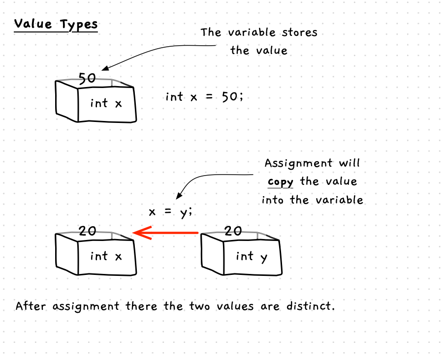
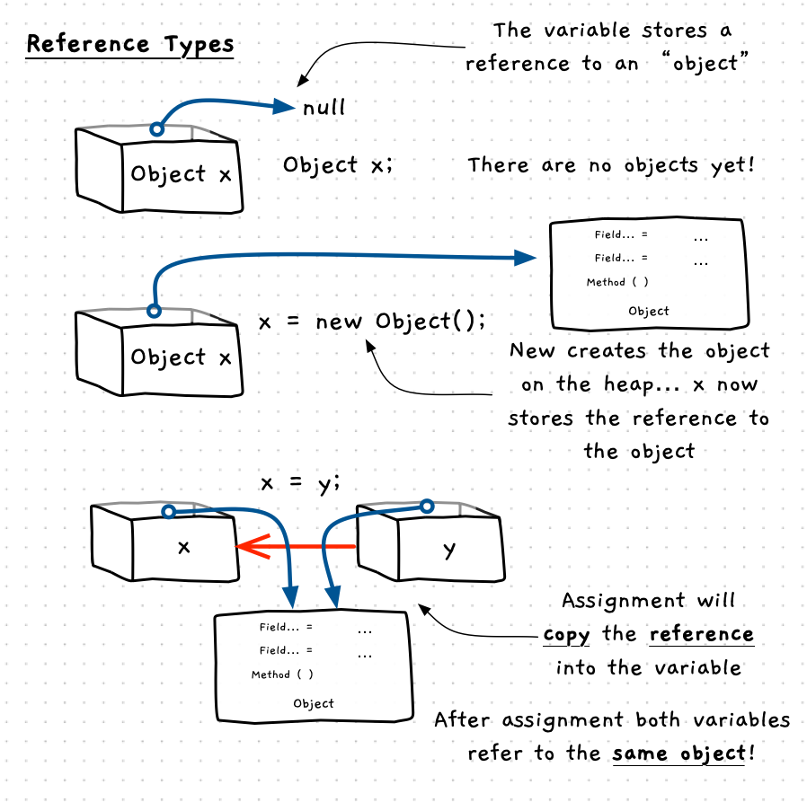

In order to understand objects in C#, we need to know that there are two different kinds of types in C#: **value types** and **reference types**. These impact what is stored in the variables of these types.

In Part 2 we looked at the idea of [pointers and references](../../../../part-2-organised-code/4-indirect-access/1-concepts/02-02-pointers-ref) and using these to indirectly access values. This idea is very powerful, but working manually with memory and memory management is very challenging.

To get around this, languages like C# give you a safer environment in which to work by focusing on references. C# does not have pointers, but instead distinguishes between two different kinds of type, being **value types** and **reference types** as noted above.

## Value Types

A variable of a value type will store a value directly - just like variables in C/C++. When you declare the variable, you are getting space to store that value. Reading the variable gets a copy of the value.

| Action | Example | Result  |
|---|---|---|
| Variable Declaration | `int x;` | You get a space to store the value  |
| Variable Assignment | `x = y;` | Value is copied from y and stored in x. There are two values in memory.  |
| Parameters  | `void Method(int x) { }` | The value is copied from y and stored in x. There are two values in memory.  |
| | `Method(y);` | |

Value types in C# include the primitive types such as `int`, `double`, and `boolean` but also include [structs](../../../../part-2-organised-code/3-structuring-data/1-concepts/03-01-struct) which you can define.

:::caution

You do not generally see the use of structs in most C# programs. These should be reserved only for cases where you have a value that you are wanting to work with, not where you have an entity that should be coded as an object using a class.

:::

## Reference Types

A reference type variable stores a reference to a value on the heap, equivalent to a pointer variable in C/C++. When you declare the variable, you are getting space to store a reference (pointer). Reading the variable gets a copy of the reference. To create a value of the reference type you need to use the `new` keyword. This creates the [object](../../../../part-2-organised-code/7-member-functions/1-concepts/1-0-struct-members#referring-to-struct-values-as-objects) and returns a reference.

| Action | Example | Result  |
|---|---|---|
| Variable Declaration | `Greeting grt;` | You get a reference/pointer that can store the address of an object. At this point there are no objects in memory, and `grt` will refer to `null` (representing nothing, or no object).  |
| Object Creation | `new Greeting("Hello World");` | This creates an object on the heap and returns a reference to that location. This code creates the object and calls its constructor.|
| Variable Assignment | `x = y;` | This copies the reference from the variable `y` and stores it in `x`. Now both `x` and `y` will refer to the same object in memory. |
| Parameters  | `void Method(Greeting x) { }` | The reference is copied from the argument and passed into the parameter. Now both x and y will refer to the same object in memory.  |
| | `Method(y);` | |

Classes are used to define reference types in C#, this means that most types are reference types. Even the `string` is an object in C#, and the String type is a class.

### Separating Variable and Value

With reference types the main thing to learn to do is to separate the variable from the value. Each variable of a reference type is like a pointer to an object of that type somewhere else in memory. This means that you can have multiple variables referring to the same object, allowing changes that occur through one reference to be observed through another.

:::tip

Remember variables of a reference type store references (pointers) to values elsewhere in memory.

:::
