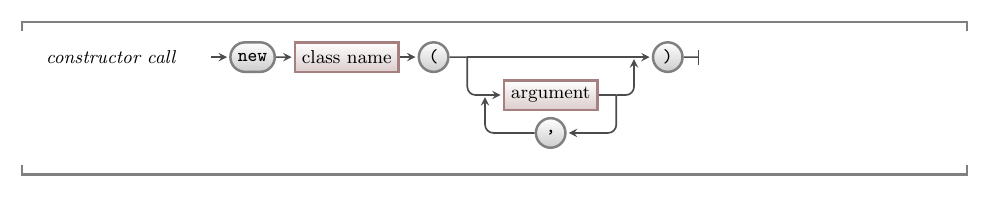

You create an object using the `new` operator.
This is much the same as we discussed in [member functions](../../../../part-2-organised-code/7-member-functions/1-concepts/1-1-constructor) in that it will do three things:

1. Assigns space in memory for the object on the [heap](../../../../part-2-organised-code/6-deep-dive-memory/1-concepts/01-heap).
2. Executes the constructor.
3. Returns a reference to the new object's location in memory.

The job of the constructor is to set the object's **initial state**.
That is, it should make sure that each of the object's fields have a sensible value.
It can do this by using literal values, values passed in through a parameter, calling constructors (i.e., if the field is of a class type), calling other methods (including methods from the class it is constructing), or a combination.

A constructor is often called as the expression within an assignment statement, so that the returned value can be stored in a variable.
We can then use that variable to ask the object about things it knows, and to ask it to do things it can do.

## In C#

:::tip[Syntax]
The syntax for calling a constructor in C# is shown below.



:::

In C# every object is created using the keyword `new`, followed by the class name, then any arguments expected by the class's constructor.

## Example

For this example we will use the Greeting class from the [classes concept](../1-0-class). To add this class to your C# project, copy the class code into a file called "Greeting.cs" within a console project.
We can now write a program that uses this class.

:::note
The name of the file doesn't actually matter, but the C# convention is to put code defining a class in a file with the same name as the class.
:::

The following code creates a `Greeting` object, and uses it to greet the user.

```cs
public class Program
{
    public static void Main()
    {
        // myGreeting is a reference to a Greeting object
        Greeting myGreeting;
        // at this point there are no objects.

        // The next line creates an object and stores a reference to
        // it in myGreeting
        myGreeting = new Greeting("Hello World");
        string name;

        Write("Enter your name: ");
        name = Console.ReadLine();

        // We can now use the object to perform one of its responsibilities
        myGreeting.Greet(name);
    }
}
```

:::caution[Reminder]
Remember that you can only interact with an object through its **interface**.
That is, you can only access fields and properties or call methods that are **public**.
:::
