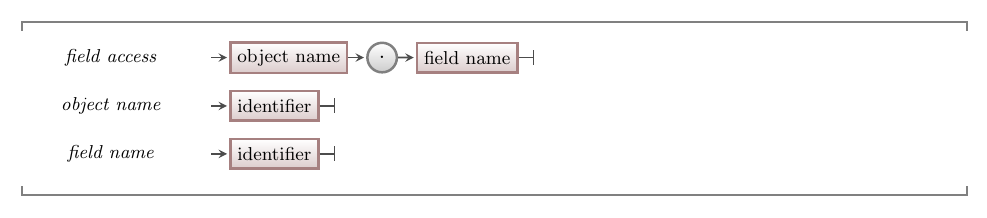

<!-- 
FIRST DRAFT, restructuring into smaller concepts

Focus on idea that object has an identity
"new" concept, creating objects but not constructors
-->

## What is an object?

Classes are a powerful tool, but on their own they don't do much to help us create digital realities.
This is because a class is just a *description* of a entity.
We need to use that description as a blueprint to **construct** an **object**.

Figure X shows a sketch of the **object** concept.
Remember that a class describes a custom data type -- an object is simply a **value** of that type.
As with any other value in a program, an object has a location in memory.
That memory is subdivided into spaces for each of the object's fields.[1](#FootnoteEntities)
These fields and their values are the **state** of the object.

Figure X: An object is an entity in memory that knows and can do things
 
<!-- TODO: remake concept diagram properly -->

Another term for an object is an **instance** of a class.
This is because the process of constructing an object can also be called **instantiating** the object.
Each instance of a class is a self-contained entity.
What this means is that although we can create multiple objects from the same class blueprint, each object we create will have its own state.
For example, if we had a "Person" class with a field "name", every instance of "Person" would have its own location in memory and its own "name" variable and value within that memory.

1In reality there is a little more to it, but we are ✨abstracting✨!

## Creating objects

You can create an object by calling the relevant class's **constructor**.
The constructor is a method that does three things:

1. Assigns space in memory for the object.
2. Executes its instructions.
3. Returns a reference to the new object's location in memory. <!-- TODO: link to section on reference/value types, and/or pointers? -->

The job of the constructor is to set the object's **initial state**.
That is, it should make sure that all of the object's fields have a sensible value.
It can do this by using literal values, values passed in through a parameter, calling constructors (i.e., if the field is of a class type), calling other methods (including methods from the class it is constructing), or a combination.

A constructor is often called as the right hand side of an assignment statement, so that the returned value can be stored in a variable.
We can then use that variable to ask the object about things it knows, and to do things it can do.

## Using an object

Once you have a reference to an object you can interact with it.
The ways in which code outside of an object can interact with an object is limited by the object's **interface**.
An object's interface is all of the public members defined in that object's class blueprint.
That means, any code with a reference to an object can access any of the object's public fields, or call any of the object's public methods.
Any fields accessed through an object act like normal variables, and any methods called within an object act like normal methods.

## In C#

### Calling a constructor

:::tip[Syntax]
The syntax for calling a constructor in C# is shown in Figure X.

Figure X: The syntax for calling a constructor
 
:::

In C# every object is created using the keyword `new`, followed by the class name, then any arguments expected by the class's constructor.

### Accessing a class field

:::tip[Syntax]
The syntax for accessing a field within an object in C# is shown in Figure X.
Note that as a property in C# acts like a field, the syntax is the same for accessing a property.

Figure X: The syntax for accessing an object's field
 
:::

You can use this syntax to interact with a field or property in an object like you would a regular variable.
For example, you can use it in an expression, an assignment statement, or as an argument.

### Calling a class method

:::tip[Syntax]
The syntax for calling a method within an object in C# is shown in Figure X.

Figure X: The syntax for calling an object's method
 
:::

The syntax to call a method within an object can be used in the same ways any regular method calls can be used.
This includes in an expression, assignment statement, or as an argument.

### Dot notation

The syntax for accessing fields, properties, and methods in a C# class is called **dot notation**.
Dot notation is used in a lot of programming languages.
It got its name because it enables us to access any public member of an object by writing the object's name, then a dot, then the name of the member we want to access.

You might be wondering why we need to do this.
That is, why can't we just call a method or access a field directly using its identifier?
The reason is that the computer needs to know the **context** of your request.

Remember that each object is self-contained, and has its own variables with their own values.
Therefore, if we are accessing a field, we need to tell the computer *which* object's field to access.
Methods also need a context, because although the instructions in a method are the same between different objects of the same type, the computer still needs to know which object's *data* to use when executing those instructions.
Dot notation allows the programmer to provide this context in a relatively concise and human-readable way.

## Example

For this example we will use the Greeting class from the [classes concept](../../../9-classes-and-objects/1-concepts/0-classes/#example).
To add this class to your C# project, copy the class code into a file called "Greeting.cs" within a console project.[1](#FootnoteEntities)
We can now write a program that uses this class.

:::caution[Reminder]
Remember that you can only interact with an object through its **interface**.
That is, you can only access fields and properties or call methods that are **public**.
:::

1The name of the file doesn't actually matter, but the C# convention is to put code defining a class in a file with the same name as the class.

## Activities

:::note[Summary]

* Constructors are used to **construct** or **instantiate objects**.
* Calling a class's **constructor** creates a new object of that class's type.
* An object can also be called an **instance** of a class.
* Constructors return a **reference** to the location in memory of the newly created object.
* A constructor should set an object's **initial state**.
* An object's **interface** is defined by all of its public members, and describes how code outside of the object can interact with it.
* Many languages use **dot notation** to access fields and call methods from an object.

:::
