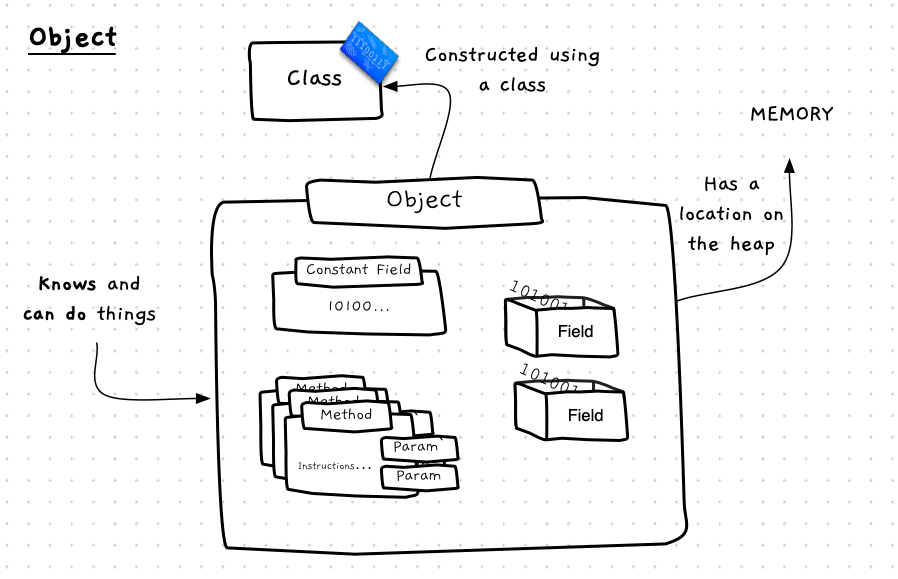

Classes are a powerful tool, but they only define a type, they are just a *description* of an entity we can create within our digital reality. On their own they do not do anything.
Instead, we need to use that description as a blueprint to **construct** **objects**. We can then use these objects to perform this role at runtime.

The image below shows a sketch of the **object** concept.
Remember that a class describes a custom data type -- an object is simply a **value** of that type.
As with any other value in a program, an object has a location in memory.
That memory is subdivided into spaces for each of the object's fields.
These fields and their values are the **state** of the object.
We can also picture the object as containing the methods that we can call to get the object to perform those actions.

Another term for an object is an **instance** of a class.
This is because the process of constructing an object can also be called **instantiating** the object.
Each instance of a class is a self-contained entity.
What this means is that although we can create multiple objects from the same class blueprint, each object we create will have its own state.
For example, if we had a "Person" class with a field "name", every instance of "Person" would have its own location in memory and its own "name" variable and value within that memory.

## Objects: Why, When, and How

While coding your object-oriented programs you need to be able to think of the objects that will exist at runtime. As you think through the steps the program runs, you can create objects and then use these to represent their respective "things" within your program. If you need a new Person object, you can create them in the code and then call methods on them to get them to perform the actions you need to occur.

*How many objects will exist in a program?*

That will depend on the size of the program, but even small programs will often have many objects. Our very first programs will only have a couple as we see how they work, but we will quickly start to have many, many objects all connected to each other in order to achieve your programs goals. Being able to picture each object as an individual will be an important skill, and will help you see how things are working.

Remember that objects are only created at runtime. So you don't *see* them in your code. You have to be able to picture what is happening as your code runs in order to start to see the objects. As you code up methods, you have to picture them being performed on an object at run time.
