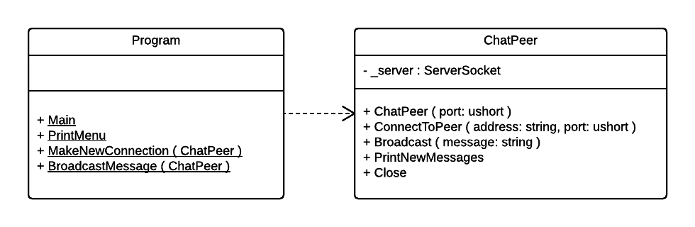
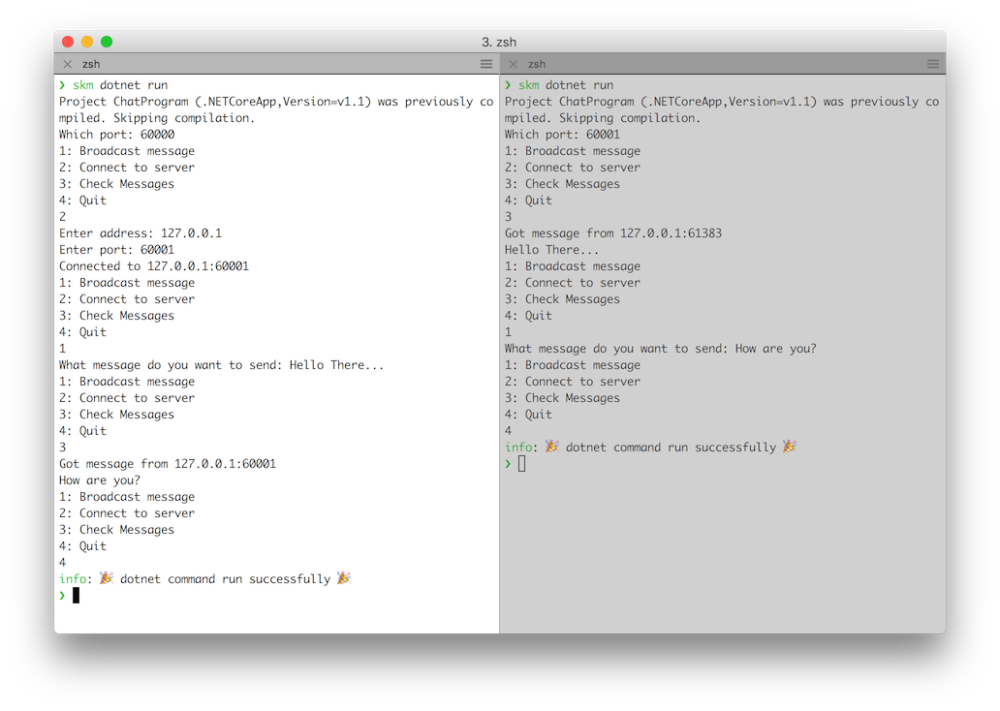

Explore the use of C# and SplashKit to make the start of a peer to peer chat program.

SplashKit provides a number of classes that will help you make interesting programs as you are learning to code. Part of the library includes classes for making networked programs.

Central to this are the three classes: **ServerSocket**, **Connection**, and **Message**. A _ServerSocket_ can be used to create a server that will listen for incoming connections. Whereas, the _Connection_ is used to make a connection to a server. Once you have a connection, you can use this to send adn receive _Messages_ across the network.

To create our peer-to-peer chat, we will need to create a **ChatPeer** that will include a server to listen to incoming connections as well being able to create connections to other peers.

The following diagram shows the **Program** and **ChatPeer** classes that we will create for this program.



## The Program
Within the Program class we have created three additional _static_ methods so that we can keep the code within `Main` manageable.

**PrintMenu** is responsible for writing out the menu of options for the user.

```cs
private static void PrintMenu()
{
    Console.WriteLine("1: Broadcast message");
    Console.WriteLine("2: Connect to server");
    Console.WriteLine("3: Check Messages");
    Console.WriteLine("4: Quit");
}
```

**MakeNewConnection** will take care of reading values from the user, and using these to tell the `ChatPeer` to make a connection to that address. To connect to the server the `ChatPeer` will need to know the address of the server, as well as the [port](https://en.wikipedia.org/wiki/Port_(computer_networking)) it is listening to. The port value is an unsigned short, which is half the size of an integer and can only store positive values.

```cs
private static void MakeNewConnection(ChatPeer peer)
{
    string address;
    ushort port;

    Console.Write("Enter address: ");
    address = Console.ReadLine();

    Console.Write("Enter port: ");
    port = Convert.ToUInt16(Console.ReadLine());

    peer.ConnectToPeer(address, port);
}
```

As with making a connection, **BroadcastMessage** will read in values from the user and use these to tell the `ChatPeer` what message to broadcast. This will then send the one message to all of the connections made to or from the `ChatPeer`.

```cs
private static void BroadcastMessage(ChatPeer peer)
{
    Console.Write("What message do you want to send: ");
    string message = Console.ReadLine();
    peer.Broadcast(message);
}
```

Both **MakeNewConnection** and **BroadcastMessage** need to be passed a `ChatPeer` that it will use to meet its responsibilities. So each of these methods has a parameter to accept a reference to the associated object.

Finally, **Main** pulls things together to make the program. It uses a loop to run while the user has not asked to quit, and a switch statement to select the appropriate action for the option the user selected.

```cs
public static void Main(string[] args)
{
    Console.Write("Which port: ");
    ushort port = Convert.ToUInt16(Console.ReadLine());
    ChatPeer peer = new ChatPeer(port);

    int opt;
    do
    {
        PrintMenu();
        opt = Convert.ToInt32(Console.ReadLine());

        switch (opt)
        {
            case 1:
                BroadcastMessage(peer);
                break;
            case 2:
                MakeNewConnection(peer);
                break;
            case 3:
                peer.PrintNewMessages();
                break;
            case 4:
                peer.Close();
                break;
            default:
                Console.WriteLine("Enter a value between 1 and 4");
                break;
        }
    } while (opt != 4);
}
```

Main starts by getting the port for the server, and then creates a new `ChatPeer` on that port.

With a do while loop, Main reads in the user's option and then switches to the matching branch. Selecting `1` will broadcast a message, `2` will make a new connection, `3` getting the peer to print all of the new messages, and `4` closes the peer and ends the loop. The default branch is also provided to output an error when the user selects an invalid option.

## The ChatPeer

The program takes care of interacting with the user, and provides overall control, which allows the `ChatPeer` to focus on managing the server and connections.

The `ChatPeer` has a **_server** field that is initialised in the constructor to be a server named "ChatServer:port" (for example: "ChatServer:60000").

```cs
private ServerSocket _server;

public ChatPeer(ushort port)
{
    _server = new ServerSocket($"ChatServer:{port}", port);
}
```

When asked to **ConnectToPeer**, the `ChatPeer` creates a new `Connection` object that will attempt to connect to the supplied address and port. It checks if this succeeded, and prints a message if the connection worked.

```cs
public void ConnectToPeer(string address, ushort port)
{
    Connection newConnection = new Connection($"{address}:{port}", address, port);
    if ( newConnection.IsOpen )
    {
        Console.WriteLine($"Connected to {address}:{port}");
    }
}
```

For the moment we are letting SplashKit remember these connections. Next week we will see you could add features to the `ChatPeer` so that it could remember the connections itself.

**Broadcast** is also very simple, it can ask the `SplashKit` class to broadcast the message to all connected clients. This will broadcast to all of the connections made to the server and those made from the calls to `ConnectToPeer`.

```cs
public void Broadcast(string message)
{
    SplashKit.BroadcastMessage(message);
}
```

**PrintNewMessages** is a little more involved, it needs to use a loop to process all of the messages that have arrived since the last time it was asked to print the messages. Notice how this code uses a _pre-test loop_ so that it works even when there are no new messages (as the loop runs 0 to many times). 

```cs
public void PrintNewMessages()
{
    SplashKit.CheckNetworkActivity();

    while ( SplashKit.HasMessages() )
    {
        using(Message m = SplashKit.ReadMessage())
        {
            Console.WriteLine($"Got message from {m.Host}:{m.Port}");
            Console.WriteLine(m.Data);
        }
    }
}
```

We have a **using** statement to ensure that the `Message` object is closed after it is read. Otherwise the message will remain in memory, even when we no longer require it.

Finally, the **Close** method is used to close the server and all connections.

```cs
public void Close()
{
    _server.Close();
    SplashKit.CloseAllConnections();
}
```

## Your Task

Have a go at using all of the above information to create the chat program.

[Download](/resources/code-examples/part-3/5-collaboration-encapsulation/ChatProgram.zip) the code and resources used in this article.

You will need to open two Terminal windows to test this out. See an example in the following screen shot.



What additional things would you like to add to this program?

Let us know in the comments.