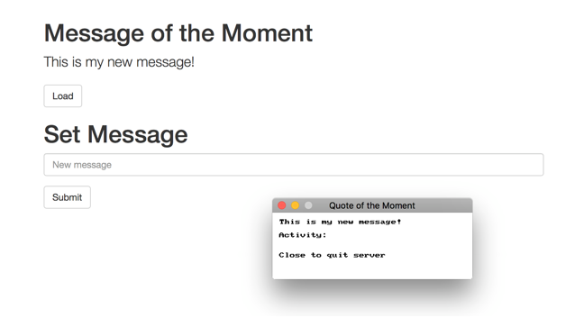

import { Steps } from '@astrojs/starlight/components';

Explore how to create a basic web server to server a _Message of the Moment_ web service.

The following UML class diagram shows the two classes we will create to build our web server.

.

## The Program

The **Program** will be responsible for coordinating the activity of our `MessageServer`, and showing a status window so that we can see when users connect to our server.

`Main` will create the `Window` and `MessageServer` objects, then run while the server is running and the user has not asked to close the window.

Within the main program loop, the code draws the current status to the window and checks if the server has incoming requests. When there is a request, it draws a green rectangle to show the activity to the user and asks the `MessageServer` object to handle the next request. We've included a delay so that you can see this activity, otherwise it would disappear very quickly!

```cs
public class Program
{
    public static void Main()
    {
        Window statusWindow = new Window("Quote of the Moment", 300, 100);
        MessageServer server = new MessageServer();

        while (server.IsRunning && !statusWindow.CloseRequested)
        {
            SplashKit.ProcessEvents();
            statusWindow.Clear(Color.White);

            statusWindow.DrawText(server.Message, Color.Black, 10, 10);
            statusWindow.DrawText("Activity:", Color.Black, 10, 30);
            statusWindow.DrawText("Close to quit server", Color.Black, 10, 60);

            statusWindow.Refresh(60);

            if (server.HasIncomingRequests)
            {
                statusWindow.FillRectangle(Color.Green, 80, 30, 10, 10);
                statusWindow.Refresh(60);

                server.HandleNextRequest();

                SplashKit.Delay(150);
            }
        }
        server.StopServer();
    }
}
```

## The Message Server

Our **MessageServer** needs to remember several things. It needs to know if it should still be running, the message of the moment, as well as being associated with a SplashKit `WebServer` object.

All of these things are remember using fields within the **MessageServer** object, and are initialised in place as shown below. The `8080` we pass to the `WebServer` tells it to listen for requests on [port](https://en.wikipedia.org/wiki/Port_(computer_networking)) 8080.

```cs
/// <summary>
/// The MessageServer creates a web server that maintains
/// a "message of the moment" which clients can read and 
/// write to.
/// </summary>
public class MessageServer
{
    /// <summary>
    /// Indicates if the server should keep running. This allows
    /// people to visit the /stop uri to kill the server.
    /// </summary>
    private bool _running = true;

    /// <summary>
    /// The message of the moment.
    /// </summary>
    private string _message = "Welcome to SplashKit server";

    /// <summary>
    /// The web server used to process client requests.
    /// </summary>
    private WebServer _server = new WebServer(8080);

    //...
```

Following this we have the properties for the `MessageServer`. These allow the `Program` to ask the message server if it is running, to read its message of the moment, and to see if it has incoming requests.

With the incoming requests, we can see if there are requests by asking the `WebServer` object if it has requests. It's great to have collaborators who can do things for you!

```cs
    /// <summary>
    /// Indicates if the server is running, or has been asked to stop.
    /// </summary>
    public bool IsRunning
    {
        get { return _running; }
    }

    /// <summary>
    /// The message of the moment.
    /// </summary>
    public string Message
    {
        get { return _message; }
        set { _message = value; }
    }

    /// <summary>
    /// Checks if the server has incoming requests
    /// </summary>
    /// <returns>True if there are incoming requests</returns>
    public bool HasIncomingRequests
    {
        get { return _server.HasIncomingRequests; }
    }
```

The methods for the `MessageServer` will stop the server and allow it to handle incoming requests.

Of these, the **HandleNextRequest** method is the most important, as it gets the `MessageServer` to process the next request that has come in from the server.

You can get the next web request from the `WebServer`, and it will give you back a `HttpRequest` object. This request knows what [URI](https://en.wikipedia.org/wiki/Uniform_Resource_Identifier) the user has asked for (basically the page they requested from the server). 

We can then query the `HttpRequest` to see what the user is trying to access. So if they are trying to get the...
* **/stop** page, we will stop the server.
* **/message** page, we will send them back a response that contains the message of the moment.
* **/index.html** or have just accessed the site (**/**) we can send them an _message_index.html_ file (which you can download [here](https://raw.githubusercontent.com/macite/sit771-fl-resources/master/week_04/message_index.html.zip)).

We also check if the user is asking to change the message (using a [put request](https://en.wikipedia.org/wiki/Hypertext_Transfer_Protocol#Request_methods)). If this is the case, then we read the body of their request to get the new message and update the value we are storing.

```cs
    /// <summary>
    /// Handles the next incoming request, and sends it a response.
    /// </summary>
    public void HandleNextRequest()
    {
        HttpRequest request = _server.NextWebRequest;

        try
        {
            if (request.IsGetRequestFor("/stop"))
            {
                request.SendResponse("Server stopped");
                StopServer();
            }
            else if (request.IsGetRequestFor("/message"))
            {
                request.SendResponse(_message);
            }
            else if (request.IsPutRequestFor("/message"))
            {
                _message = request.Body;
                request.SendResponse();
            }
            else if (request.IsGetRequestFor("/index.html") || request.IsGetRequestFor("/"))
            {
                request.SendHtmlFileResponse("message_index.html");
            }
            else
            {
                request.SendResponse(HttpStatusCode.HttpStatusBadRequest);
            }
        }
        catch
        {
            request.SendResponse(HttpStatusCode.HttpStatusInternalServerError);
        }
    }
}
```

When asked to **StopServer**, the `MessageServer` checks that it is running, to make sure you can't stop the server twice. The server then changes its `_running` field to false so it remembers that it is stopped, before it tells teh `WebServer` object to `Stop`.

```cs
    /// <summary>
    /// Stops the server.
    /// </summary>
    public void StopServer()
    {
        if ( _running )
        {
            _running = false;
            _server.Stop();
        }
    }
```

## Your Task

Try getting this code to work, then run the program to interact with it.

When you run the program you will see a status window that shows the current message, but the main way to interact with the program is via a web browser.

<Steps>

1. Open a web browser.
2. Navigate to the following URL (copy/paste it into your browser):

    ```plaintext
    http://localhost:8080/message
    ```

    Now you should see the current message!

3. Navigate to the following URL (copy/paste it into your browser):

    ```plaintext
    http://localhost:8080/index.html
    ```

    Or just to:

    ```plaintext
    http://localhost:8080/
    ```

    Now you should see the web page contained within the message_index.html file.

4. You can close the window or kill the server by navigating to:

    ```plaintext
    http://localhost:8080/stop
    ```

</Steps>



[Download](/resources/code-examples/part-3/5-collaboration-encapsulation/WebServerMOTD.zip) the code and resources used in this article.

What happens if you try to revisit the page after you close the Window or stop the server?
