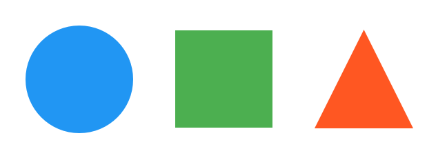
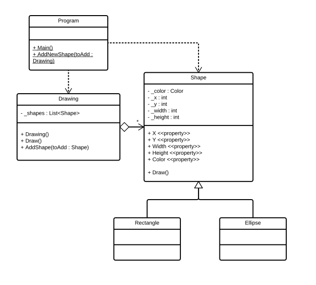

Object oriented programming is all about creating objects that know and can do things. Key to this process is the use of **abstraction** in order to identify appropriate classes (roles) and to identify responsibilities for these classes.

## What are these?

Have a look at the following image. What are these? If you were to create classes to represent these what would those classes be called?

We can see that the image contains a circle, rectangle, and triangle. So it would be possible to have these as three different classes within our solution. However, these classes would share many common responsibilities. For example, each has a color, a position on the screen, and can be drawn. Inheritance gives us some additional capabilities which allow us to better model these classes, while also helping us to reduce code duplication.

Inheritance allows you to extend abstraction to support **specialisation** and **generalisation**, creating a family of related types. In our drawing example, we could _generalise_ the circle, rectangle, and triangle to identify the more general role **Shape**. Similarly, if you had said that the image above contained shapes, then you could _specialise_ these to identify the specific roles of circle, rectangle, and triangle. The result is the same, we have **is a kind of** relationships between the `Circle`, `Rectangle` and `Triangle` classes and the `Shape` class.

With inheritance we create a family of related types. The `Circle`, `Rectangle`, and `Triangle` are all `Shape` objects and they can **inherit** behaviour (knowledge and responsibilities) from the `Shape` class. This means that we can code _common_ attributes (methods and fields) in the `Shape` class, and then 

In UML, we represent inheritance using a line with an open triangular arrow head. The following diagram shows our Shape Drawing program with support for `Ellipse` and `Rectangle` shapes. You can read the arrow from these classes to `Shape` as "Rectangle _is a kind of_ Shape" and "Ellipse _if a kind of_ Shape".

When we have an inheritance relationship, we think of one class as the **parent** and the other as the **child**. So the `Shape` is the parent class, and the `Rectangle` and `Ellipse` are both children. In this relationship, the _child_ will _inherit_ all of the features from the _parent_ class. So `Rectangle` objects will have a `Color`,  `X`, `Y`, `Width` and `Height`, and they will be able to `Draw`. Similarly, the `Ellipse` objects will have the same set of features as these are all _inherited_ from the `Shape` class. The great thing here is that you can code these responsibilities once within the parent class, and then inherit them within the child classes.

## Single Inheritance

In C#, and many modern object oriented languages, it is only possible to inherit from a single parent class. This avoids some complex scenarios where multiple inheritance is allowed, but is a limitation that you need to keep in mind.

For further reading see:
* [Inheritance](https://en.wikibooks.org/wiki/C_Sharp_Programming/Inheritance) in C# Programming

For help with syntax details, see this week's [syntax guide](../08-syntax-guide).