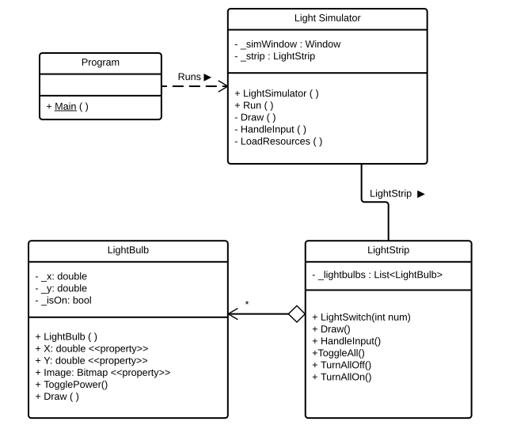

Recap the use of UML class diagrams to communicate the static structure of your solutions 

The Class Diagram from the Unified Modeling Language (UML) allows you to communicate the structure of your solutions. Within an UML Class Diagram rectangular boxes are used to represent the classes within the solution. Each classes box is divided into three sections:

- At the top you have the **name** of the class.
- The next section contains the **fields** or attributes of the class, describing what the object _knows_.
- The bottom section contains the **methods** and **properties** of the class, describing what the object _can do_.

Between the boxes you can add **relationships** to indicate how objects of these classes are related. This describes which objects know about which? There are three kinds of relationship:

- **Dependency** is a dashed arrow, indicating that objects of one class make use of another class but do not remember this for longer periods. You can think of this as a **uses-a** relationship. For example, the `Program` **uses a** `LightSimulator`.
- **Association** is a **has-a** or **knows-a** kind of relationship. This is a more permanent link, and is implemented using a field within the class. For example, the `LightSimulator` **has a** `LightStrip`.
- **Aggregation** is a special kind of association where you are indicating that there is a whole-part of containment relationship. For example, the `LightStrip` **contains** `LightBulb` objects, which could also be thought of as the `LightBulb` object being **part of** the `LightStrip`.

With a UML Class Diagram you can examine the responsibilities of the different classes, and see how they are connected together.

Read about the class diagram at:

- IBM's [UML Basics](http://www.ibm.com/developerworks/rational/library/769.html?ca=drs-) on [The Class Diagram](http://www.ibm.com/developerworks/rational/library/content/RationalEdge/sep04/bell/index.html)
- [Microsoft's class diagram reference](https://msdn.microsoft.com/en-us/library/dd409437.aspx)

## Your Task

Reflect on what can be communicated in a class diagram, and think about its strengths and weaknesses.

Let us know in the comments.
